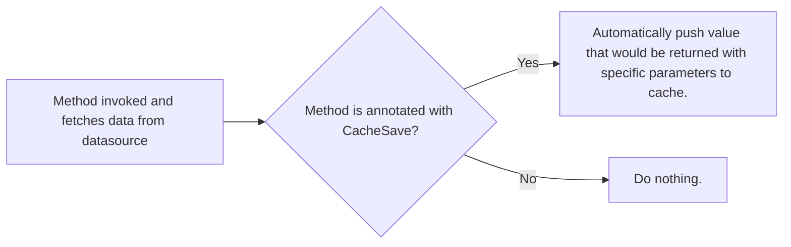
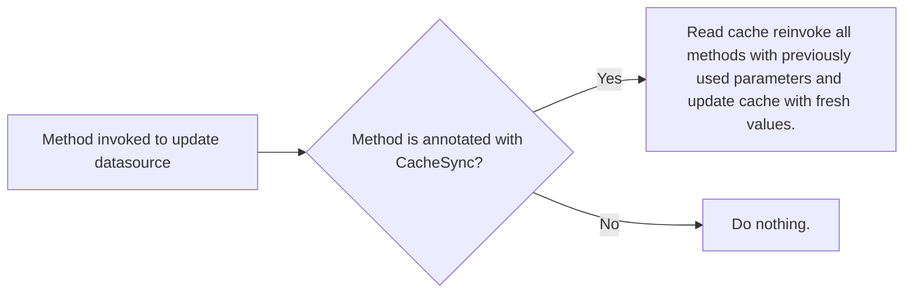

[](https://maven-badges.herokuapp.com/maven-central/io.github.vashilk/redis-cache) [](https://app.codacy.com/gh/vashilK/Redis-cache/dashboard?utm_source=gh&utm_medium=referral&utm_content=&utm_campaign=Badge_grade)[](https://codeclimate.com/github/vashilK/Redis-cache) [](https://snyk.io/test/github/vashilK/Redis-cache)  [](https://www.gnu.org/licenses/gpl-3.0) [](https://www.zenodo.org/badge/latestdoi/561818709)

# Redis-cache
Java client for redis to provide method-caching with cache synchronization feature based on Springboot's implementation of Redis with added functionality.

## What is Redis-cache for?

Redis-cache is a library built on spring-redis to provide an enhanced method caching feature to your application which
works at method level by using
the provided annotations.




## Prerequisites

You require the following dependencies:

```xml

<dependency>
    <groupId>org.springframework.data</groupId>
    <artifactId>spring-data-redis</artifactId>
    <version>2.7.14</version>
</dependency>

<dependency>
    <groupId>redis.clients</groupId>
    <artifactId>jedis</artifactId>
    <version>3.9.0</version>
</dependency>
```

If you decide to upgrade the dependency versions make sure they are compatible with Jedis3 and not Jedis4
as the paths for classes changed in the new version; the code will fail.

## Getting Started

To get started with Redis-Cache, first add it as a dependency in your Java project. If you're using Maven, that looks like this:

```xml

<dependency>
    <groupId>io.github.vashilk</groupId>
    <artifactId>redis-cache</artifactId>
    <version>1.0.0-BETA</version> <!-- io.github.vashilk.version -->
</dependency>
```

For Gradle:

```kotlin
implementation("io.github.vashilk:redis-cache:1.0.0-BETA")
```

Next you will need to connect to your Redis instance

```java

@Configuration
public class RedisConfig {

    @Bean
    public JedisConnectionFactory connectionFactory() {
        RedisStandaloneConfiguration configuration = new RedisStandaloneConfiguration();
        configuration.setHostName("localhost");
        configuration.setPort(6379);
        return new JedisConnectionFactory(configuration);
    }

    @Bean
    public RedisTemplate<String, Object> redisTemplate() {
        RedisTemplate<String, Object> template = new RedisTemplate<>();
        template.setConnectionFactory(connectionFactory());
        template.setKeySerializer(new StringRedisSerializer());
        template.setHashKeySerializer(new StringRedisSerializer());
        template.setHashKeySerializer(new JdkSerializationRedisSerializer());
        template.setValueSerializer(new JdkSerializationRedisSerializer());
        template.setEnableTransactionSupport(true);
        template.afterPropertiesSet();
        return template;
    }

}
```

You can use your own connection to have access to a Redis-cluster with multiple redis-instances but
make sure the implementation beneath uses RedisTemplate for the annotation to work properly.

## Annotations

```java
@CacheSave(group = "group-name")
```
Any method annotated with the one above will be cached. Designed to be used on methods that return data, specifically
for heavily used ones with similar parameters.
####
Using annotation:

```java
import org.nki.redis.cache.annotations.CacheSave;

@CacheSave(group = "Book")
public Book getBookById(Long id){
    // do something
}
```
The method above will be cache under the group "Book".
###
```java
@CacheRelease(group = "group-name")
```

Works as a cache eviction, any method annotated with this will clear a whole group cached with the same group-name
before the method runs.
####
Using annotation:

```java
import org.nki.redis.cache.annotations.CacheRelease;

@CacheRelease(group = "Book")
public void resetCacheForBooks(){
    // do something
}
```
The method above once invoked will clear every entry in the cache for the group "Book";
###
```java
@CacheSync(group = "group-name")
```

Methods annotated with the one above will trigger a synchronization of data for all methods
annotated with @CacheSave with the same 'group-name'. This annotation is designed to be used on methods
which modify the datasource from where you are querying but can be also used in events where you wish to
manually trigger a synchronization.
####
Using annotation:

```java
import org.nki.redis.cache.annotations.CacheSync;

@CacheSync(group = "Book")
public void saveBooks(List<Book> books){
    // do something
}
```
Once a method annotated with @CacheSync is invoked it will clear the cache for the
group "Book" and reinvoke all the methods with parameters cached updating all the values in the cache,
hence keeping the cache and data-source synchronized at all times for the group "Book".
###

### Model

This tool serializes and deserializes models you use in your method constructors, in order for it to work properly you need to
annotate the models you wish to be cached with:

```java
@RedisCacheSerializable
```

Using annotation with the Object:
```java
@Data
@RedisCacheSerializable
public class MyClass {
    private String name;
    private Boolean isAllowed;
}
```

Using the object in method:
```java
public void save(MyClass myClass){
    // do something
}
```
Using it this way will allow easy serialization & deserialization of the object as method
parameters. No adding the annotation and generating the type classes will result in code failure.

#### To generate the models that this tool requires please add this plugin to your pom and use this command:

```xml

<build>
    <plugins>
        <plugin>
            <groupId>org.codehaus.mojo</groupId>
            <artifactId>exec-maven-plugin</artifactId>
            <version>3.0.0</version>
            <executions>
                <execution>
                    <id>generate-typeReference-on-compile</id>
                    <phase>compile</phase>
                    <goals>
                        <goal>java</goal>
                    </goals>
                    <configuration>
                        <mainClass>org.nki.redis.cache.generator.ModelGenerator</mainClass>
                    </configuration>
                </execution>
            </executions>
        </plugin>
    </plugins>
</build>
```

#### command:

```shell
mvn clean install
```
Once command run you should be able ot see all TypeReference classes for classes annotated with
@RedisCacheSerializable in target > generated-sources > main > java
There classes are really important to serialize and deserialize your objects in cache correctly.


### Spring AOP config

Since the aspects are defined inside this library you will need make your Spring project aware of them. We are going to use the annotation based configuration method. Add the following configuration:

```java
@Configuration
@EnableAspectJAutoProxy
public class AspectConfig {

    private final RedisTemplate<String, Object> template;
    private final ObjectMapper objectMapper;

    public AspectConfig(RedisTemplate<String, Object> template, ObjectMapper objectMapper) {
        this.template = template;
        this.objectMapper = objectMapper;
    }

    @Bean
    public CacheSyncHandler cacheSyncHandler() {
        return new CacheSyncHandler(template, objectMapper);
    }

    @Bean
    public CacheSaveHandler cacheSaveHandler() {
        return new CacheSaveHandler(objectMapper, template);
    }

    @Bean
    public CacheReleaseHandler cacheReleaseHandler() {
        return new CacheReleaseHandler(template);
    }
}
```

## Enable Logging
If you require details of when the aspects are triggering and the details of the 
operation, add this to your application.properties file.

```properties
redis-cache.enable.logs = true
```

## Compilation issues

If your code includes Lombok as a dependecy and you experience any build issues with your code after adding the
dependencies and plugins in
intelliJ idea before deployment do the following:

Go to Project Structure, Modules, select AspectJ and check Post-compile weave mode.
This will ensure ajc runs after Lombok and can see the generated classes.

## Errors connecting to Redis
Add these to your application.properties file.

```properties
spring.redis.host = localhost
spring.redis.port = 6379
```

## Contributing

This is a completely open source project, it is an idea that came up to me when using Redis in
one of my projects. All help and collaborations to refine and make this strong solution are welcome you can contact me
at my [LinkedIn](https://mu.linkedin.com/in/neeschal-kissoon-03ab7516b).
